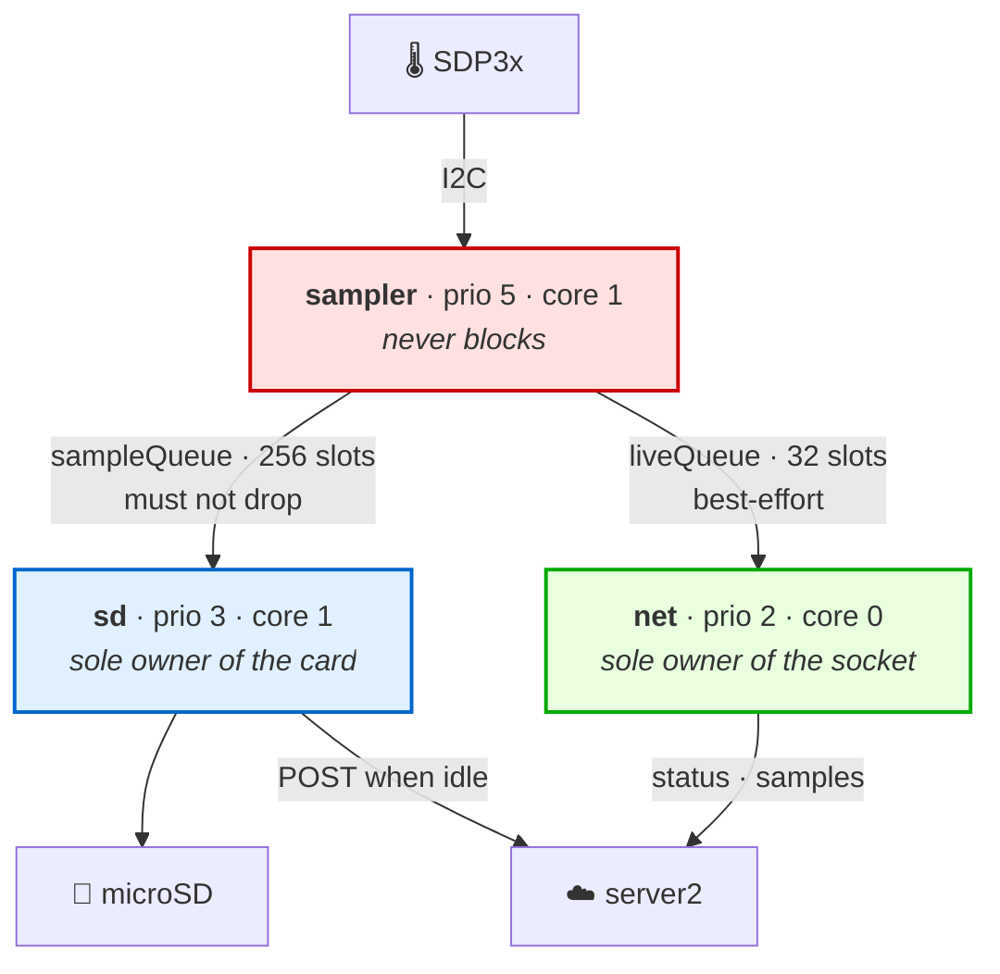
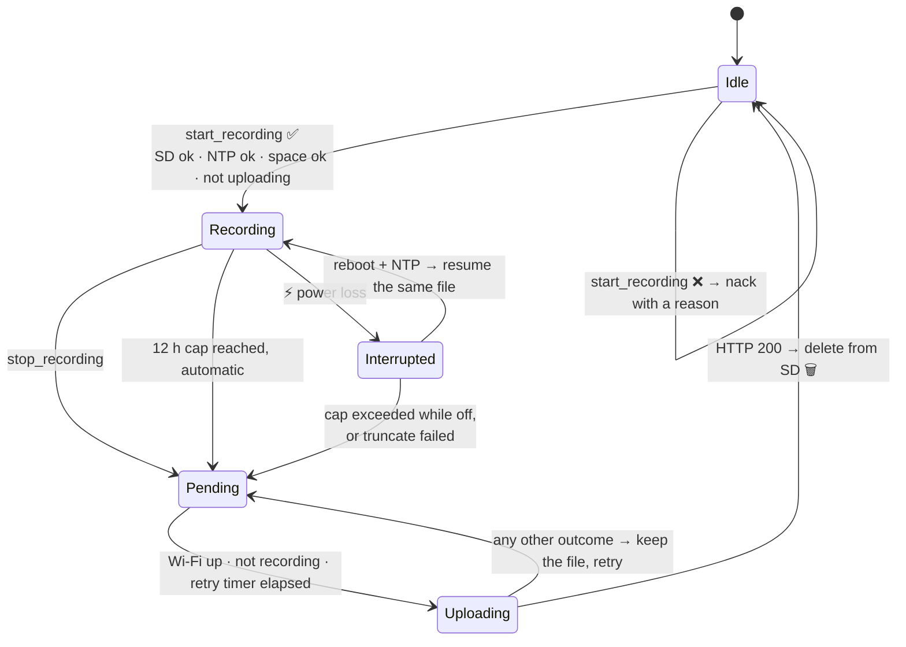

<div align="center">

# 🏛️ WatchAir — Architecture

*The long-form version of the [README](README.md): what each piece is responsible for,
which invariants hold the system together, and what happens when things break.*

</div>

---

## 📑 Contents

1. [Design principles](#1---design-principles)
2. [System boundaries](#2---system-boundaries)
3. [Firmware: the task model](#3---firmware-the-task-model)
4. [The timing model](#4---the-timing-model)
5. [Recording lifecycle & durability](#5---recording-lifecycle--durability)
6. [The protocol](#6---the-protocol)
7. [server2: the relay](#7---server2-the-relay)
8. [Trust boundaries](#8---trust-boundaries)
9. [Persistence](#9---persistence)
10. [Frontend](#10---frontend)
11. [Failure mode catalogue](#11---failure-mode-catalogue)
12. [Known limitations](#12---known-limitations)

---

## 1 · 🎯 Design principles

Five rules that everything else follows from. Where a decision looks odd, it's usually one of
these being enforced.

| # | Principle | Enforced by |
|:--:|:--|:--|
| **1** | **The device is the source of truth.** The server mirrors it; it never decides on the device's behalf or keeps its own tally. | `hub.Device` fields are written by exactly one line — the one that handles `status` |
| **2** | **The file is the authority.** `started_at`, duration and identity all come from the `.bin` header, never from a server clock. | `recordings._parse()` |
| **3** | **The UI derives nothing.** No connection ⇒ "disconnected", full stop. With a connection, show what arrived, verbatim. | `device_status()` sends a flat mirror of the last `status` |
| **4** | **Data is only deleted against proof.** An HTTP `200` is the device's only permission to free SD space. | `uploader.cpp` |
| **5** | **The 25 Hz deadline is sacred.** Nothing in the sampling path may block — no SD, no radio, no mutex. | task/queue split in `main.cpp` |

---

## 2 · 🧱 System boundaries

Three deployables. The split is drawn along **failure isolation**, not along technology.

```
   📟 ESP32 ──── ws:// ────► ⚙️ server2 ────► 🗄️ Supabase ◄──── 🖥️ server1 ◄──── 🌐 Browser
   (edge)      + POST bin     (EC2)          (Postgres +        (Vercel)          ▲
      │                          ▲            Storage)                            │
      │                          └────────── wss:// + Bearer JWT ──────────────────┘
      │                                       (browser talks to server2 directly)
      └── 💾 microSD: the recording lives here first, and stays until a 200 arrives
```

### Responsibility split

| | 🖥️ **server1** (Next.js / Vercel) | ⚙️ **server2** (FastAPI / EC2) |
|:--|:--|:--|
| **Owns** | identity, sessions, history UI | live sockets, device control, ingestion |
| **State** | stateless — session lives in a cookie | in-memory only, rebuilt from the next `status` |
| **Supabase** | reads only (`devices`, `recordings`) | the **only** writer; holds the service key |
| **Talks to devices** | never | exclusively |
| **If it dies** | no login, no history; **recording continues** | no live view, no start/stop; **recording continues** |

Both failure rows end the same way, and that's the point: **the edge does not depend on the cloud
to do its job.** Losing the cloud costs you visibility and control, never data.

### Why the browser talks to server2 directly

server1 could have proxied everything. It doesn't, because proxying would put a serverless
function in the path of a 25 Hz WebSocket — the one shape serverless is worst at. Instead server1
mints a short-lived JWT and steps out of the way. The two servers share exactly one thing: the
signing secret.

---

## 3 · 🧵 Firmware: the task model

### The problem with one `loop()`

The first firmware was a single cooperative loop. Two things broke it:

- **SD flushes block.** A slow card can stall >100 ms — at 25 Hz that's 2–3 samples gone.
- **Uploads are long.** A multi-megabyte POST had to be chopped into a hand-rolled state machine
  just to keep the 2-second heartbeat alive, and the state machine was the most bug-prone code in
  the project.

Both are the same bug: *one thread with a hard real-time deadline was also doing unbounded I/O.*

### The split



| Task | Prio | Core | Stack | Responsibility | May block? |
|:--|:--:|:--:|:--:|:--|:--|
| `sampler` | 5 | 1 | 4 KB | read sensor at 25 Hz, enqueue | ❌ **never** |
| `sd` | 3 | 1 | 10 KB | drain queue → card; upload when idle | ✅ freely |
| `net` | 2 | 0 | 12 KB | `ws.loop()`, status, live view, Wi-Fi watchdog | ✅ briefly |

**Core pinning.** `sampler` and `sd` share core 1 — producer next to consumer. `net` gets core 0
alone, so a 6 MB upload never competes for cycles with the sampling deadline. `sd` gets a 10 KB
stack because `HTTPClient` is a stack hog; `net` gets 12 KB for the same reason on the WebSocket side.

### Queues encode different contracts

```cpp
constexpr size_t SAMPLE_QUEUE_LEN = 256;  // ~10 s of slack — recording must not drop
constexpr size_t LIVE_QUEUE_LEN   = 32;   // best-effort — dropping a live frame is cosmetic
```

The sampler enqueues to both with **timeout 0**. It never waits on anything. If the live queue is
full, that frame is gone and nobody minds. The recording queue is sized so that the worst
realistic flush fits inside it — that's the whole reason for the 8:1 ratio.

### Synchronisation, in full

The entire concurrency surface is three primitives, and it fits in a paragraph:

- **One mutex** (`recorderMutex`, priority-inheriting) guards every `recorder` call — so a
  `start_recording` arriving on `net` doesn't queue behind an SD flush at a lower priority.
- **Three snapshot getters** (`recUuidSnapshot`, `startedEpochMsSnapshot`, `pendingSnapshot`) are
  the *only* lock-free reads. They exist so the 2-second status can be built from RAM without
  ever waiting on the card.
- **`volatile bool` flags**, each with exactly one writer. Bool access is atomic on Xtensa, and
  single-writer means no read-modify-write race is possible.

The sampler participates in none of it. It touches no `recorder` state and takes no lock — which
is precisely why the 25 Hz deadline can be guaranteed rather than hoped for.

### The snapshot write-order trick

Two fields describe one recording, and the status reads them without a lock. So the write order
is chosen to make every observable interleaving coherent:

- **starting**: write the date **first**, then the uuid;
- **stopping**: clear the uuid **first**, then the date.

A reader that sees a non-empty uuid therefore *always* sees its date already in place. The
in-between states are `("", stale-date)` — harmless, because the uuid is what's tested. A lock
would also work; this costs nothing and can't deadlock.

---

## 4 · 🕒 The timing model

Three distinct clock problems, three separate answers.

### 4.1 Drift — solved by `vTaskDelayUntil`

```cpp
TickType_t lastWake = xTaskGetTickCount();
for (;;) {
  vTaskDelayUntil(&lastWake, pdMS_TO_TICKS(LOOP_TIME_MS));  // 40 ms
  ...
}
```

The period is measured from the **previous wake-up**, not from "now". A late iteration shortens
the next one; error never accumulates. The naive `lastSample = millis()` form drifts by exactly
the sum of every overrun — over 12 hours, unbounded.

### 4.2 Latency — stamp at read, not at write

```cpp
Sample s{millis(), p, t, (int16_t)round(p * 100.0f)};   // stamped by the sampler
```

Between reading a sample and writing it sit a queue, a mutex, and possibly a flush. That delay is
*variable*, so stamping at write time would inject exactly the jitter the 25 Hz task was built to
avoid. The timestamp travels with the sample.

### 4.3 Wall-clock jumps — anchor once

SNTP corrects by **stepping**, roughly hourly. A recording that consulted the wall clock per
sample would inherit those steps as discontinuities. So the timeline is anchored once, at start
or resume:

```
t_ms = (millis() of the reading − anchorMillis_) + deltaMs_
```

- `anchorMillis_` — the `millis()` at which this *stretch* of recording began
- `deltaMs_` — how much was already recorded before it (`0` for a new recording; hours, if resuming)

After that the recording never reads the wall clock again. The absolute origin
(`started_epoch_ms`) was captured once, in the header, and that single number places the whole
relative timeline in real time.

> ⚠️ **No clock ⇒ no recording.** If NTP hasn't resolved, `start` is NACKed and resume is
> deferred. A recording with an invented origin is worse than no recording, because nothing
> downstream could tell the difference.

---

## 5 · 💾 Recording lifecycle & durability

### 5.1 States



Note that `Uploading → Pending` is the default edge. Deleting requires a `200`; **everything
else** — a 4xx, a 5xx, a timeout, a dropped connection, a lost response — leaves the file exactly
where it was.

### 5.2 The `active` marker

`/rec/active` contains one thing: the UUID of the in-flight recording. Written once at start,
deleted at stop, **never rewritten periodically** — a periodic write is just a slower way to
corrupt the one file you need intact after a crash.

Everything else needed to resume lives in the `.bin`'s own header. There is no second source that
could disagree with it.

### 5.3 Resume, step by step

`resumeIfPending()` runs on the SD task once NTP is up, and bails out safely at each check:

| Check | If it fails |
|:--|:--|
| `/rec/active` exists? | nothing to do |
| marker non-empty, `.bin` exists, ≥ 30 bytes? | orphan marker → delete it |
| header magic is `WAIR`? | not ours → drop the marker |
| `now ≥ started_epoch_ms`, and < 12 h elapsed? | cap exceeded while powered off → leave as pending upload |
| `(size − HEADER) % 6 == 0`, else `truncate()` | truncate fails → leave as pending upload |

The worst case is *losing the resume*, never losing data: a file that can't be continued is still
a perfectly good file to upload.

### 5.4 Truncation, defended twice

A power cut mid-flush leaves a partial record at the tail. Two independent defences:

1. **On the device** — `resumeIfPending()` truncates the unaligned remainder before appending.
   Without it, new records would sit at a 1–5 byte offset and every subsequent record would be
   misaligned garbage.
2. **On the server** — `n = (len(data) − HEADER_SIZE) // RECORD_SIZE` discards the tail
   unconditionally, every time.

Redundant on purpose. The server rule is one line and covers *any* truncated file, including one
where the board never got the chance to clean up after itself. Defence 1 protects the recording;
defence 2 protects the parse.

### 5.5 The outage is data

Nothing backfills a gap. A power cut appears as a real jump between consecutive `t_ms` values, and
that jump survives the whole pipeline into the chart:

```ts
const GAP_MS = 1000;
if (prevT !== null && tMs - prevT > GAP_MS) points.push([..., null]);  // break the line
```

The threshold is 1 s rather than "any missed sample" deliberately: a single I2C glitch shouldn't
pepper a 12-hour chart with holes, but a real disconnection must never be drawn as a straight line
across missing minutes. The series renders with `connectNulls: false`, so a `null` is a visible
break — an honest "no data here" instead of a plausible-looking invention.

### 5.6 Why the upload has no resume protocol

No chunking, no offsets, no checksums — and that's a decision, not an omission:

- 12 h at 25 Hz ≈ **6.5 MB**, which fits in one request comfortably.
- The SD copy isn't deleted until a `200`, so a failed attempt costs bandwidth and nothing else.
- Resuming would mean re-reading the file prefix off the SD card to compute a checksum — nearly
  as expensive as just resending it, plus a protocol to get wrong.

The one exception to delete-on-200: a header-only file (stopped before the first sample) is
dropped locally. It has no data to lose, and the server would reject it as empty forever.

---

## 6 · 📡 The protocol

### 6.1 Two planes

| | Transport | Carries |
|:--|:--|:--|
| **Control** | WebSocket, **text only** | `status`, `nack`, commands, live samples |
| **Bulk** | HTTP `POST /device/upload` | the raw `.bin`, unmodified |

Keeping binary off the WebSocket means the socket's job is small, framing is uniform, and a
multi-megabyte transfer can't stall the heartbeat that proves the device is alive.

### 6.2 `status` — the only state message

Sent on connect, on **every** state change, and every 2 s regardless:

```jsonc
{
  "type": "status",
  "uuid": "8d257ddd-…",         // which device
  "boot_id": "a1b2c3d4",        // random per boot — reboot detector
  "rec_uuid": "…" | null,       // non-null ⟺ recording in progress
  "rec_started_epoch_ms": 1234567890123,
  "recording": true,            // convenience; server2 deliberately drops it
  "broadcasting": true,
  "uploading": false,
  "pending": 0,                 // .bin files awaiting upload
  "ntp_ok": true,
  "t_ms": 91234                 // uptime — free, and exposes reboot loops
}
```

**Hard rule: the status never touches the SD card.** It reads only in-RAM snapshots — which is
why `pending` is a counter maintained by start/stop/resume/confirm rather than a directory scan,
and why free space isn't reported at all (`SD.usedBytes()` walks the FAT and can take hundreds of
ms; and if space is short, the `start` NACK already says so).

`recording` is redundant with `rec_uuid != null`, so server2 drops it rather than forwarding it.
Two fields that can contradict each other are one field too many, and the browser should never be
in a position to have to pick a winner.

### 6.3 Commands and acknowledgement

```
server2 → device : {"type":"start_recording","uuid":"<new-uuid>"}
                   {"type":"stop_recording"}
                   {"type":"start_broadcast"} / {"type":"stop_broadcast"}

device → server2 : {"type":"nack","uuid":"…"|null,"reason":"…"}   ← failure only
```

**There is no ACK message.** Success is confirmed by the next `status` carrying the requested
`rec_uuid` (or `null` for a stop). The device *demonstrates* its new state instead of *promising*
it — and since the device already emits a status the instant anything changes, this costs nothing
in latency.

Failures do get their own message, because "nothing happened" is indistinguishable from "still in
flight" until a timeout expires. A `nack` carries the actual reason (no space, no NTP, currently
uploading, already recording) straight through to the browser, so the user sees *why* rather than
watching a spinner die after 5 seconds.

Concurrency around this is handled by a per-device `asyncio.Lock`. Without it, a second `POST
/recordings/start` would overwrite the first one's `ack` future and leave that request hanging
until its timeout. With it, the second request enters the lock, observes that a recording is
already running, and returns the current status — idempotent by construction.

### 6.4 Live samples

```jsonc
{"t": 91234, "p": 12.345, "temp": 23.45}
```

No `type` field, and no batching. Two deliberate choices:

- **Dispatch by shape.** The server routes on `type is None and "p" in data`. At 25 Hz this is
  the hot path; the sender writes it with `snprintf` rather than paying ArduinoJson's overhead
  1,500 times a minute.
- **No batching.** Batching would trade latency for throughput — the wrong trade for a live
  waveform, where the whole point is that the line moves when the chest does.

---

## 7 · 🔄 server2: the relay

### 7.1 State that isn't persisted

```python
devices:          dict[str, Device]         # connected boards
subscribers:      dict[str, set[WebSocket]] # browsers watching a device
live_subscribers: dict[str, set[WebSocket]] # ⊂ subscribers — those that want samples
```

All in memory, none written down. That's safe *because* of Principle 1: restart server2 and every
device rebuilds the picture within one status interval. Persisting it would create a second source
of truth that could disagree with the device — the exact failure mode the whole design avoids.

### 7.2 Broadcasting as derived state

"Should this device stream?" is never stored. It's computed:

```python
desired = bool(live_subscribers.get(uuid))   # ≥1 browser actually drawing ⇒ stream
```

Streaming is triggered by *edges* on that set — the first `?live=1` subscriber sends
`start_broadcast`, the last one to leave sends `stop_broadcast`. The recordings page subscribes
without `live`, so it sees device state without putting the board into 25 Hz emission for a
waveform nobody is drawing.

### 7.3 The reconciliation loop

Commands travel over a network; networks lose things. A 1 Hz loop compares desired against
reported and repairs the difference:

```python
if desired == dev.broadcasting:   dev.mismatch_since = None
elif dev.mismatch_since is None:  dev.mismatch_since = now
elif now - dev.mismatch_since >= RECONCILE_GRACE_S:   # 3 s
    await dev.send({"type": "start_broadcast" if desired else "stop_broadcast"})
    dev.mismatch_since = now                          # don't resend every tick
```

The grace period absorbs normal in-flight latency; resetting the timestamp after a resend turns
it into a rate limiter rather than a flood. This is a controller reconciling observed state
toward desired state — the same idea as a Kubernetes control loop, at microcontroller scale.

Recording commands need no equivalent, because they're already confirmed synchronously by
status-or-nack.

### 7.4 Liveness

Two independent timers, deliberately not sharing a source:

| Where | Timeout | Reasoning |
|:--|:--|:--|
| server2 → device | `ONLINE_TIMEOUT_S = 7` | 3 s (one status of margin) was too tight — a slow `loop()` triggered false offlines and a reconnect storm |
| browser → server2 | `SILENCE_MS = 7000` | with a device connected, *something* arrives every 2 s; silence means the chain is broken somewhere |

The browser measures silence against `Date.now()`, not by trusting a timer to have fired:
suspending a laptop or backgrounding a tab freezes timers, and a "7-second" timer would then
measure anything but 7 seconds. It also re-checks on `visibilitychange` and `online`, and drops
immediately on `offline`.

### 7.5 Upload handling

```python
async for chunk in request.stream():
    data.extend(chunk)
    if len(data) > config.MAX_UPLOAD_BYTES:      # 16 MB
        raise HTTPException(413, "Grabación demasiado grande")
```

Never `await request.body()`: that trusts `Content-Length`, and a lying one is a one-line memory
exhaustion. The 16 MB cap sits well above the 6.5 MB worst case so a format change can't reject a
legitimate recording.

Status codes are chosen so the device's retry behaviour is correct without the device knowing
anything about the failure:

| Situation | Code | Device does |
|:--|:--:|:--|
| Bad credentials | `403` | retries (it may be a provisioning error) |
| Unparseable header | `400` | retries, but it will keep failing — file stays on SD for manual rescue |
| Too large / empty | `413` / `400` | keeps the file |
| Storage or DB failure | `503` | keeps the file, retries later ✅ |
| Success | `200` | **deletes the file** 🗑️ |

Getting this wrong in the generous direction — a `200` on a failed write — would delete a
recording that was never stored. Every uncertain path therefore returns an error.

### 7.6 Write ordering

```python
db.upsert_recording(...)   # 1. row (uploaded_at stays NULL)
db.upload_blob(...)        # 2. bytes to Storage
db.mark_uploaded(...)      # 3. uploaded_at = now
```

The order makes partial failure legible. Crash after step 1 and you get a row with
`uploaded_at IS NULL` — *this recording exists and its bytes are missing*, which is a queryable
fact rather than a mystery. The reverse order would leave an orphaned blob with nothing pointing
at it.

All three are idempotent (both writes are upserts) because the device retries the whole upload
whenever it doesn't see a `200` — including when the `200` was sent but lost. Replaying costs
nothing.

---

## 8 · 🔒 Trust boundaries

```
🧑 Human ──Google OAuth──► 🖥️ server1 ──HS256 JWT (15 min)──► ⚙️ server2 ◄──uuid+secret── 📟 ESP32
```

### Human → server1

Google OAuth via Auth.js v5, plus an allowlist that runs *before* a session exists:

```ts
async signIn({ user }) {
  const device = await getDeviceByEmail(user.email);
  return device !== null;     // no row in `devices` ⇒ no session at all
}
```

Authentication proves *who*; the `devices` table decides *whether*. There's no self-signup path.

### Browser → server2

A 15-minute HS256 JWT carrying `{email, uuid_device}`, minted by `/api/server2-token`.

- **In memory only**, never `localStorage` — it expires in 15 minutes; persisting it only widens
  the attack surface.
- **The WebSocket enforces its own expiry**: `receive_text` waits with `timeout = exp − now` and
  closes with `4401` when the token dies, so a tab left open overnight can't outlive its
  credential.
- **The socket is read-only.** Every command is an authenticated HTTP `POST`. A compromised
  socket can watch; it cannot act.
- Reconnection re-mints, so an expiry-triggered close heals on the next attempt automatically.

### ESP32 → server2

```python
expected = config.DEVICE_SECRETS.get(uuid)
return expected is not None and secrets_lib.compare_digest(expected, secret)
```

- **Per-device secrets, not a shared one.** With a shared secret, any board could impersonate any
  other. Here a stolen credential compromises exactly one device.
- **The map is the whitelist.** An unlisted UUID isn't "unauthorised", it doesn't exist.
- **`compare_digest`** — constant-time, so comparison timing leaks nothing.
- Credentials travel in the query string, hence base64url secrets: the ESP32 has no reasonable
  URL-encoder available, and `+`/`/` in a query string are a bug waiting to happen.

### Supabase

The service role key bypasses RLS and **never leaves EC2**. The browser never contacts Supabase
at all — reads go through server1's route handlers, writes exclusively through server2.

---

## 9 · 🐘 Persistence

```sql
create table devices (
  uuid       uuid primary key,       -- hardcoded into that board's firmware
  username   text not null,
  email      text not null unique,   -- gates Google sign-in
  created_at timestamptz not null default now()
);

create table recordings (
  uuid              uuid primary key,      -- from the .bin header
  device_uuid       uuid not null references devices(uuid),
  started_at        timestamptz not null,  -- from the header, never now()
  ended_at          timestamptz,           -- started_at + last t_ms
  file_path         text,                  -- path inside the "watchair" bucket
  duration_seconds  integer,
  uploaded_at       timestamptz,           -- NULL = row exists, blob missing
  created_at        timestamptz not null default now()
);
```

**The row is born on upload, not on start.** Until the file arrives, the recording exists only on
the SD card, and the UI shows it from the live status. This is what keeps the history list honest:
every row in it is a recording whose bytes are actually stored.

**Duration comes from the last sample's `t_ms`, not from a record count.** Counting records would
under-report any recording containing a gap — precisely the recordings where accuracy matters most.

Blobs land at `<device_uuid>/<recording_uuid>.bin` in a private `watchair` bucket, byte-identical
to what was written on the card.

---

## 10 · 🌐 Frontend

### Reads never touch the browser's Supabase client

`/api/recordings`, `/api/devices` and `/api/recordings/[uuid]/data` are route handlers. Supabase
credentials stay server-side, and the binary decoder runs on the server — the browser receives
`[seconds, pressure|null]` points with the gap rule already applied, not 6.5 MB of raw records to
parse on the main thread.

### The socket hook

`useFrontendSocket` handles reconnection, token refresh and freshness in one place:

- **Re-mints on every (re)connect** — if the close was an expiry, the retry already carries a
  fresh token.
- **`onOpen` fires on every reconnect**, not just the first: while the socket was down, server
  pushes were missed, so that's the moment to resynchronise.
- **`fresh`** goes false after 7 s of silence. `device_offline` from the server is the fast path;
  this is the backstop for when the socket is formally open but the chain behind it is broken.
- **`live`** is opt-in, and it's what makes the board emit at all. Only the page drawing the
  waveform asks for it.

### Rendering

Apache ECharts, with `connectNulls: false` so a decoded `null` is a visible break in the line
rather than an interpolation across missing data. The UI is deliberately brutalist — thick
borders, hard shadows, no rounded corners — which is also cheap to repaint at 25 Hz.

---

## 11 · 🔥 Failure mode catalogue

Every one of these was designed for rather than discovered.

| Failure | What happens | Data lost |
|:--|:--|:--:|
| 📶 Wi-Fi drops mid-recording | Sampling and SD writes continue; watchdog forces reconnect every 10 s; upload waits | **none** |
| ⚡ Power cut mid-recording | On reboot: NTP → truncate tail → resume same file; outage becomes a chart gap | only the outage |
| ⚙️ server2 restarts | Device reconnects, next `status` rebuilds everything within 2 s | **none** |
| 🖥️ server1 down | No login and no history; the device is untouched | **none** |
| 💾 Upload fails (any reason) | No `200` ⇒ no delete; retried every 5 s | **none** |
| 📉 `200` sent but response lost | Device retries the whole upload; upserts make the replay a no-op | **none** |
| 🔌 SD card missing at boot | Retried 5× with backoff; if absent, live view still works, recording is refused with a reason | recordings impossible |
| 🕐 No NTP at boot | `start` NACKed, resume deferred; SNTP restarted by the Wi-Fi watchdog | **none** |
| ⏱️ 12 h cap hit | Recorder closes the file itself; `statusDirty` propagates it before the upload begins | **none** |
| 🔀 Two `start` requests race | Per-device `asyncio.Lock`; the second sees a live `rec_uuid` and returns the current status | **none** |
| 📡 `start_broadcast` lost | Reconciliation loop detects the mismatch and resends after 3 s | live frames only |
| 🔑 Browser token expires | WS closes `4401`; reconnect mints a fresh token | **none** |
| 🌡️ I2C read fails | That sample is skipped; `sensorOk` goes false; gaps >1 s break the line | that sample |
| 🔁 Board in a reboot loop | Changing `boot_id` with a small `t_ms` exposes it in the status stream | — |

The row that matters: **the only scenario that loses recorded data is the one where the data was
never captured.** Everything downstream of the SD write is recoverable.

---

## 12 · 🚧 Known limitations

Deliberate trade-offs, listed honestly.

| Limitation | Why it's acceptable today | What it would take |
|:--|:--|:--|
| `allow_origins=["*"]` | Every endpoint is independently authenticated; CORS isn't the control | Pin to the deployed origin — flagged with a `TODO` in `main.py` |
| ESP32 → server2 is plain `ws://` | The device secret is the credential; traffic is a pressure waveform | `ws.beginSSL()` + certificate management on the board |
| Devices provisioned by hand | Three users, one household | A provisioning flow and a `device_secrets` table |
| Upload buffered fully in RAM | 6.5 MB worst case against a 16 MB cap on a server with room | Stream straight into Storage |
| One device per user | Matches the hardware that exists | The schema already supports many; the JWT carries a single `uuid_device` |
| Migrations applied by hand | Two files, applied once | Alembic, or Supabase CLI migrations |
| No automated tests | Prototype; the hard parts are timing behaviours that need hardware | Host-side tests for the codec, a fake device for the hub |

---

<div align="center">

**[← Back to the README](README.md)**

<sub>⚠️ WatchAir is a personal engineering project. It is <b>not</b> a medical device.</sub>

</div>
