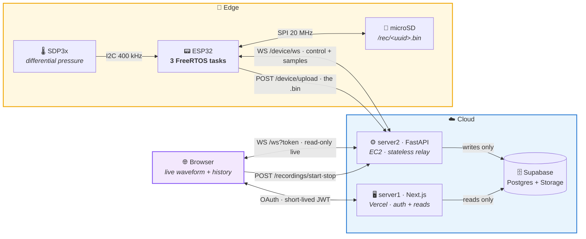
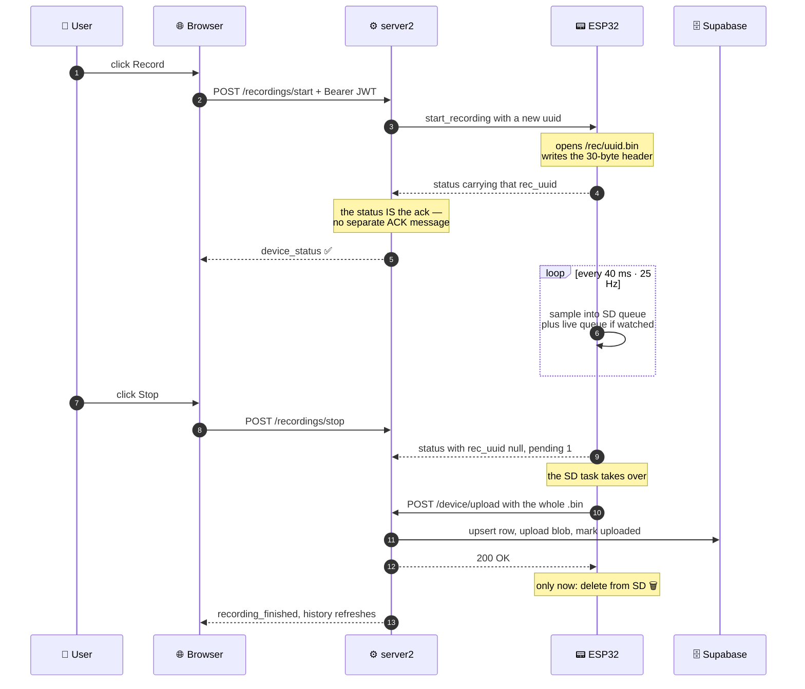
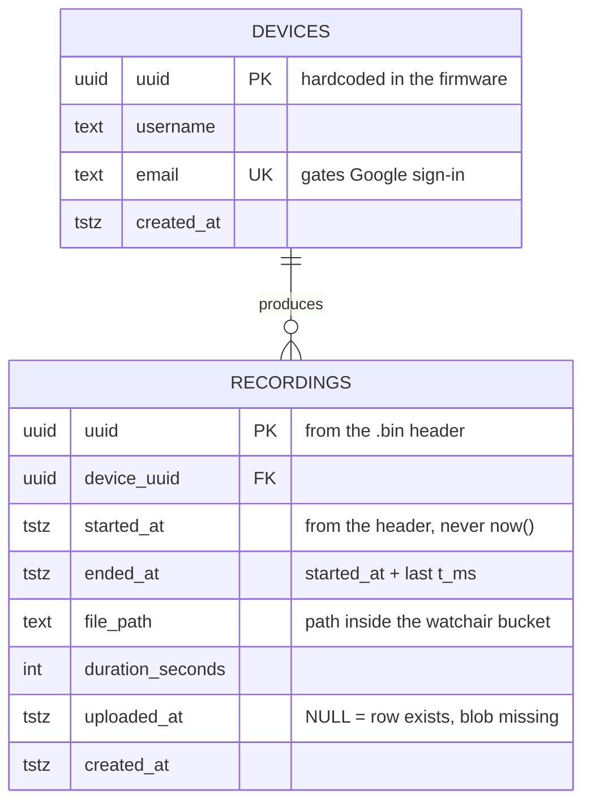

<div align="center">

# 🌬️ WatchAir

### Real-time respiratory monitoring — from the sensor die to the browser canvas

*A full-stack IoT system that samples a differential-pressure sensor at a rock-steady 25 Hz,
survives power cuts without losing a single breath, and streams the waveform live to the web.*

<br/>

[](https://www.espressif.com/)
[](https://isocpp.org/)
[](https://fastapi.tiangolo.com/)
[](https://nextjs.org/)
[](https://www.typescriptlang.org/)
[](https://supabase.com/)

[](LICENSE)
[](#-roadmap)
[](ARCHITECTURE.md)

<br/>

**[Highlights](#-highlights) · [Architecture](#-architecture) · [Deep dives](#-engineering-deep-dives) · [Getting started](#-getting-started) · [Wire format](#-on-disk--on-the-wire-format)**

</div>

---

## 🎯 What is this?

WatchAir records **breathing** as a pressure waveform. A nasal cannula feeds a
[Sensirion SDP3x](https://sensirion.com/products/catalog/SDP31) differential-pressure sensor wired
to an **ESP32**. The board samples it at **25 Hz**, writes every sample to a microSD card, and — when
somebody is actually watching — mirrors the same samples live to a browser over WebSocket.

The interesting part isn't the graph. It's everything that has to be true for the graph to be
trustworthy:

> The device keeps recording when the Wi-Fi drops. It resumes a recording after a power cut,
> mid-file, with the timeline intact. It never deletes a recording until the server has
> confirmed it in writing. And the UI never *guesses* what the device is doing — it can only
> show what the device actually said.

---

## ✨ Highlights

| | | |
|:---|:---|:---|
| 🎚️ **Jitter-free sampling** | `vTaskDelayUntil` on a dedicated FreeRTOS task pinned to core 1 | no cumulative drift, ever |
| 🧵 **Three tasks, one job each** | sampler · SD · network, on separate priorities and cores | a 100 ms SD flush can't eat a sample |
| 💾 **SD-first, cloud-second** | samples hit the card before they hit the network | Wi-Fi is an optional luxury |
| ⚡ **Crash-resumable recordings** | a reboot mid-recording picks the same file back up | the gap shows as a gap, not as a lie |
| 🔒 **Delete-on-200 uploads** | the device only frees SD space after an HTTP `200` | idempotent retries, zero data loss |
| 📡 **Demand-driven streaming** | the ESP32 only broadcasts at 25 Hz when a browser is *looking* | no radio burn for nobody |
| 🧠 **Single source of truth** | one `status` message describes the whole device | the UI derives nothing, it mirrors |
| 🔑 **Per-device secrets** | every board has its own credential, not a shared one | one board can't impersonate another |
| 🎨 **Brutalist UI** | thick borders, hard shadows, no rounded corners | ECharts at 25 Hz without dropping frames |

---

## 🧩 Architecture

Three deployable pieces, each with a job it doesn't share.



### Why two servers?

They fail differently, so they're separated on purpose:

| | 🖥️ **server1** — Next.js / Vercel | ⚙️ **server2** — FastAPI / EC2 |
|:--|:--|:--|
| **Owns** | identity, sessions, history pages | live sockets, device control, ingestion |
| **State** | stateless (session in a cookie) | in-memory only — rebuilt from the next `status` |
| **Supabase** | reads only | the **only** writer (holds the service key) |
| **If it dies** | you can't log in; recording continues | live view stops; **the device keeps recording** |

The only bridge between them is a **15-minute HS256 JWT**: server1 signs `{email, uuid_device}`,
the browser carries it straight to server2. server1 never proxies a command, server2 never sees a
Google session.

### The path of one breath



---

## 🧠 Engineering deep dives

The decisions worth defending in an interview. Click to expand — or read
**[ARCHITECTURE.md](ARCHITECTURE.md)** for the long version.

<details>
<summary><b>🧵 Three tasks instead of one <code>loop()</code></b></summary>

<br/>

The firmware started as a single cooperative `loop()`. It didn't survive contact with a slow SD
card: a flush can block for **>100 ms**, which at 25 Hz is 2–3 lost samples, and the upload had
to be chopped into a state machine just to keep the heartbeat alive.

The rewrite gives each concern its own task:

| Task | Prio | Core | Job | May block? |
|:--|:--:|:--:|:--|:--|
| `sampler` | 5 | 1 | read sensor at 25 Hz, enqueue | ❌ **never** — no SD, no radio, no mutex |
| `sd` | 3 | 1 | drain queue → card; upload when idle | ✅ freely |
| `net` | 2 | 0 | `ws.loop()`, status, live view, Wi-Fi watchdog | ✅ briefly |

The two queues express different *contracts*:

```cpp
constexpr size_t SAMPLE_QUEUE_LEN = 256;  // recording: ~10 s of slack, must not drop
constexpr size_t LIVE_QUEUE_LEN   = 32;   // live view: best-effort, drops are fine
```

The sampler enqueues with **timeout 0** to both. Losing a live frame is cosmetic; losing a recorded
sample is data loss — so the recording queue is sized to absorb the worst flush, and the live one
isn't. The network task runs on core 0 so a multi-megabyte upload never competes with sampling.

</details>

<details>
<summary><b>⏱️ Timestamps that don't drift — and don't jump</b></summary>

<br/>

Two separate problems, two separate fixes.

**No drift.** The sampler uses `vTaskDelayUntil`, which schedules from the *previous wake-up*
rather than from "now". A late iteration makes the next one shorter; error never accumulates.
The old `lastSample = millis()` approach drifted by exactly however long each iteration overran.

**No jumps.** A sample's `t_ms` is anchored once, at start-or-resume:

```
t_ms = (millis() of the reading − anchorMillis_) + deltaMs_
```

After that, the timeline never consults the wall clock again — so the ~hourly SNTP step
corrections (which arrive as *jumps*, not slews) can't warp a recording. And samples are stamped
with the `millis()` of **when the sensor returned them**, not when they were written: between
those two moments sit a queue, a mutex, and possibly a flush.

</details>

<details>
<summary><b>🔌 Surviving a power cut mid-recording</b></summary>

<br/>

`/rec/active` holds the UUID of the in-flight recording. It's written once at start, deleted at
stop — never rewritten periodically, because a periodic write is just a slow way to corrupt it.

On boot, once NTP has resolved (no real clock ⇒ no honest timestamps ⇒ **no recording**), the SD
task calls `resumeIfPending()` and continues the same file. Everything needed to resume — the
`started_epoch_ms` that defines the whole timeline — lives in the file's own 30-byte header.

The tail of a file interrupted mid-flush is garbage, and it's handled in **two independent
places**:

- the ESP32 truncates the unaligned remainder before resuming;
- the server discards it unconditionally, `n = (len − HEADER) // RECORD_SIZE`.

Belt and braces on purpose: the one-line server rule covers *any* truncated file, whether or not
the board ever got the chance to clean up after itself.

The outage itself isn't erased — it survives as a real jump between two consecutive `t_ms`
values, and the chart renders it as a **break in the line**, not as a straight segment
interpolating over missing minutes.

</details>

<details>
<summary><b>📡 Broadcasting as derived state, not as a command</b></summary>

<br/>

Streaming 25 Hz over Wi-Fi when nobody's watching is pure waste. So "should the device broadcast?"
is never a stored flag — it's a **function of the current subscriber set**:

```python
desired = bool(live_subscribers.get(uuid))   # ≥1 browser watching ⇒ broadcast
```

Only clients that connect with `?live=1` join `live_subscribers`. The recordings page watches
device state but draws no waveform, so it *doesn't* put the board into 25 Hz emission for nobody.

A once-per-second reconciliation loop compares desired vs. reported and re-sends the command if
they disagree for more than a grace period. That makes a dropped command **self-healing** instead
of permanently wedging the system — the same idea as a Kubernetes controller loop, on a
microcontroller budget.

</details>

<details>
<summary><b>🧾 One status message, zero client-side inference</b></summary>

<br/>

There's no `hello` and no ACK message. There is exactly one device→server message shape, sent on
connect, on every state change, and every 2 s regardless:

```jsonc
{ "type": "status", "uuid": "…", "boot_id": "a1b2c3d4",
  "rec_uuid": "…|null", "rec_started_epoch_ms": 1234567890123,
  "recording": true, "broadcasting": true, "uploading": false,
  "pending": 0, "ntp_ok": true, "t_ms": 91234 }
```

Consequences that fall out of that one decision:

- **The status *is* the ack.** `start` resolves when the requested `rec_uuid` shows up — the
  device proving its state, not promising it. Only failures get their own message (`nack`).
- **`rec_uuid != null` ⇔ recording.** The device sends a convenience `recording` flag, but the
  server deliberately drops it and never forwards it: two fields that could contradict each other
  are one field too many, so the browser gets `rec_uuid` and derives the rest.
- **The server keeps no books.** Restart server2 and every device rebuilds it in ≤2 s.
- **`boot_id` + `t_ms`** are free diagnostics: two different `boot_id`s in a row, with a small
  `t_ms`, is a reboot loop caught without any extra instrumentation.

Hard rule: **the status never touches the SD card.** It reads only in-RAM snapshots (hence the
cached pending-count), because a 2-second heartbeat that can block on a slow card isn't a
heartbeat.

</details>

<details>
<summary><b>🔒 Auth: three trust boundaries, three mechanisms</b></summary>

<br/>

| Boundary | Mechanism | Why this one |
|:--|:--|:--|
| Human → server1 | Google OAuth (Auth.js v5) | `signIn` rejects any email without a `devices` row — no self-signup |
| Browser → server2 | 15-min HS256 JWT, in-memory only | short enough that revocation lists are unnecessary; never in `localStorage` |
| ESP32 → server2 | per-device `uuid` + secret, `compare_digest` | the UUID whitelist *is* the secrets map: unknown UUID ⇒ no such device |

Extra hardening worth noting:

- The browser socket is **read-only**. Every command goes through authenticated HTTP `POST`.
- The socket enforces its own expiry: `receive_text` waits with `timeout = exp − now` and closes
  `4401` when the token dies, so a long-lived tab can't outlive its own credential.
- Uploads stream with a running cap, never `await request.body()` — a lying `Content-Length`
  can't balloon server memory.
- The Supabase **service key never leaves EC2**. The browser never talks to Supabase at all;
  reads go through server1's route handlers.

</details>

<details>
<summary><b>💾 Why a 6-byte binary record and not JSON</b></summary>

<br/>

12 hours at 25 Hz is 1.08 M samples. As JSON that's ~40 MB and an ESP32-hostile serializer in the
hot path. As fixed 6-byte records it's **6.5 MB**, a `memcpy` into a write buffer, and an
`offset += 6` parser on the other end.

The buffer size isn't arbitrary either:

```cpp
constexpr size_t WRITE_BUFFER_RECORDS = 85;   // 85 × 6 = 510 B ≈ one 512 B card block
```

Pressure ships as `int16` centipascals — 0.01 Pa resolution, ±327 Pa range, comfortably beyond
what a breath through a cannula produces.

</details>

---

## 🛠️ Tech stack

<table>
<tr>
<td width="33%" valign="top">

### 📟 Firmware
`C++` · `Arduino-ESP32`<br/>
`FreeRTOS` · `PlatformIO`

- 3 pinned tasks, 2 queues, 1 mutex
- SPI microSD @ 20 MHz
- I2C Sensirion SDP3x @ 400 kHz
- SNTP · WebSocket client
- Wi-Fi watchdog + auto-resume

</td>
<td width="33%" valign="top">

### ⚙️ Backend
`Python 3.11+` · `FastAPI`<br/>
`uvicorn` · `uv` · `PyJWT`

- Async WS hub, zero persistence
- 1 Hz reconciliation loop
- Streaming upload with a hard cap
- Supabase Postgres + Storage
- AWS EC2 + Cloudflare Tunnel

</td>
<td width="33%" valign="top">

### 🌐 Frontend
`Next.js 16` · `React 19`<br/>
`TypeScript 5` · `Tailwind 4`

- Apache ECharts @ 25 Hz
- Auth.js v5 · Google OAuth
- Auto-reconnecting WS hook
- Binary decoder in a route handler
- Deployed on Vercel

</td>
</tr>
</table>

---

## 📐 On-disk & on-the-wire format

One `.bin` per recording, `/rec/<uuid>.bin`. Identical bytes on the SD card, in the HTTP body,
and in Supabase Storage — nothing re-encodes it along the way.

**Header — 30 bytes** *(format v3)*

| Offset | Size | Field | Notes |
|:--:|:--:|:--|:--|
| `0` | 4 | magic | ASCII `WAIR` |
| `4` | 1 | version | `3` |
| `5` | 16 | uuid | raw bytes — must match the POST's `recording` param |
| `21` | 1 | hz | `25` |
| `22` | 8 | `started_epoch_ms` | u64 LE — **the** t=0 for the whole timeline |

**Record — 6 bytes, repeated**

| Offset | Size | Field | Notes |
|:--:|:--:|:--|:--|
| `+0` | 4 | `t_ms` | u32 LE, ms since `started_epoch_ms` |
| `+4` | 2 | `p_centiPa` | i16 LE, pressure × 100 |

> 💡 `started_epoch_ms` is in **milliseconds, not seconds** — truncating to seconds would leave up
> to 999 ms of skew between the header's claimed origin and the origin the samples are actually
> stamped against. That same header field is what names the recording and fills `started_at` in
> Postgres. The server never substitutes a `datetime.now()`. **The file is the authority.**

Three implementations must agree on these bytes, and each one says so in a comment:
[`esp32/include/recorder.h`](esp32/include/recorder.h) ·
[`server/app/recordings.py`](server/app/recordings.py) ·
[`frontend/app/lib/binaryFormat.ts`](frontend/app/lib/binaryFormat.ts)

---

## 🗂️ Repository layout

```
WatchAir/
├── 📟 esp32/                       PlatformIO firmware
│   ├── include/
│   │   ├── recorder.h              SD recording + binary format + resume
│   │   ├── protocol.h              WS control messages (status, commands)
│   │   ├── uploader.h              one POST per recording, delete on 200
│   │   ├── shared.h                cross-task flags and the recorder mutex
│   │   └── secrets.h               🔑 git-ignored — see secrets.h.example
│   ├── src/
│   │   ├── main.cpp                the three tasks + setup()
│   │   ├── recorder.cpp            file lifecycle, snapshots, pending list
│   │   ├── protocol.cpp            status serialisation, command dispatch
│   │   └── uploader.cpp            streaming upload from an open File
│   └── platformio.ini              board, framework, lib deps
│
├── ⚙️ server/                      FastAPI relay (server2)
│   ├── app/
│   │   ├── main.py                 routes: /ws, /device/ws, /device/upload, /recordings/*
│   │   ├── hub.py                  in-memory devices + subscribers + reconciliation
│   │   ├── recordings.py           command/ack lifecycle, .bin parsing, persistence
│   │   ├── auth.py                 browser JWT verification
│   │   ├── db.py                   the only Supabase writer
│   │   └── config.py               env parsing, fail-fast on missing vars
│   ├── migrations/                 SQL, applied by hand in the Supabase editor
│   └── pyproject.toml              uv-managed deps, pinned by uv.lock
│
├── 🌐 frontend/                    Next.js app (server1)
│   ├── app/
│   │   ├── realtime/               live waveform page
│   │   ├── recordings/             history list + playback
│   │   ├── api/                    route handlers (Supabase reads, token minting)
│   │   ├── components/             LiveWaveform, Sidebar
│   │   └── lib/                    api client, WS hook, binary decoder, formatting
│   └── auth.ts                     Auth.js v5 config + device gating
│
├── 📖 ARCHITECTURE.md              the long-form technical write-up
├── 📝 toDo.md                      design decisions & open threads (Spanish)
└── 🧰 utils.md                     deploy/flash command cheatsheet
```

---

## 🚀 Getting started

### 📋 Prerequisites

| Tool | Version | For |
|:--|:--|:--|
| [PlatformIO](https://platformio.org/) | latest | building & flashing the ESP32 |
| [Python](https://www.python.org/) + [uv](https://docs.astral.sh/uv/) | 3.11+ | server2 |
| [Node.js](https://nodejs.org/) | 20+ | frontend |
| [Supabase](https://supabase.com/) project | — | Postgres + Storage |

<br/>

<details open>
<summary><b>1️⃣ &nbsp;Database</b></summary>

<br/>

Run both migrations in the Supabase SQL editor, in order:

```
server/migrations/001_init.sql      # devices + recordings tables, seed rows
server/migrations/002_uploaded_at.sql
```

Then create a **private** Storage bucket named `watchair`. Each recording lands at
`<device_uuid>/<recording_uuid>.bin`.

</details>

<details>
<summary><b>2️⃣ &nbsp;Backend — server2</b></summary>

<br/>

```bash
cd server
cp .env.example .env          # then fill in the real values
uv sync                       # uv manages the venv for you

# development (auto-reload)
uv run uvicorn app.main:app --reload --host 0.0.0.0 --port 8000

# production
uv run uvicorn app.main:app --host 0.0.0.0 --port 8000
```

`DEVICE_SECRETS` is `uuid:secret,uuid:secret`. Use **base64url** secrets (no `+` or `/`): they
travel in the ESP32's WebSocket query string, and the board has no decent URL-encoder on hand.

Missing any required variable is a **startup crash, not a runtime surprise** — see
[`config.py`](server/app/config.py).

</details>

<details>
<summary><b>3️⃣ &nbsp;Frontend — server1</b></summary>

<br/>

```bash
cd frontend
cp .env.example .env.local    # then fill in the real values
npm install
npm run dev                   # → http://localhost:3000
```

Set up a Google OAuth client (*Web application*) and add the callback to its authorised redirect
URIs:

```
http://localhost:3000/api/auth/callback/google      # local
https://<your-domain>/api/auth/callback/google      # production
```

> ⚠️ An `https://` page cannot open a `ws://` or `http://` connection (mixed content). Serve
> server2 over TLS — a [Cloudflare Tunnel](https://developers.cloudflare.com/cloudflare-one/connections/connect-networks/)
> is the quickest way — and point `NEXT_PUBLIC_SERVER2_URL` at it, scheme included, no trailing slash.

</details>

<details>
<summary><b>4️⃣ &nbsp;Firmware — ESP32</b></summary>

<br/>

```bash
cd esp32
cp include/secrets.h.example include/secrets.h   # git-ignored; fill it in
platformio run -t upload -t monitor
```

**Wiring** (ESP32 devkit defaults — see the constants at the top of
[`main.cpp`](esp32/src/main.cpp)):

| Peripheral | Bus | Pins |
|:--|:--|:--|
| Sensirion SDP3x | I2C @ 400 kHz, addr `0x25` | `SDA=4` · `SCL=21` |
| microSD module | VSPI @ 20 MHz | `CS=5` · `SCK=18` · `MISO=19` · `MOSI=23` |

*If `SD.begin()` fails or returns corrupt data, drop `SD_SPI_HZ` to `10000000` — some modules and
breadboard wiring won't hold 20 MHz.*

</details>

---

## 🗄️ Data model



The row is created **when the file arrives**, not when recording starts. Until then the recording
exists only on the SD card, and the UI shows it from the live `status` — never from the database.
That's what makes `uploaded_at IS NULL` meaningful: the row is there, the bytes aren't, and you
can see exactly that.

---

## 🧭 Roadmap

- [x] 25 Hz drift-free sampling on a dedicated task
- [x] Binary recording format with crash-resume (v3)
- [x] Per-device authentication + upload whitelist
- [x] Live waveform + recording history with playback
- [x] Idempotent delete-on-200 upload pipeline
- [ ] 🔐 Lock CORS down to the deployed origin *(currently `*` — flagged in `main.py`)*
- [ ] 📈 Breath-rate derivation (breaths/min) from the pressure signal
- [ ] 📤 CSV / EDF export for the recordings
- [ ] 🔁 Automated CI for firmware build + frontend lint
- [ ] 🌍 Self-service device provisioning (today it's hardcoded)

---

## 📚 Further reading

| Document | What's in it |
|:--|:--|
| **[ARCHITECTURE.md](ARCHITECTURE.md)** | The full technical write-up: task model, protocol, failure modes |
| **[toDo.md](toDo.md)** | Design decisions and open threads, as they were argued out *(Spanish)* |
| **[utils.md](utils.md)** | Flash / deploy / SSH command cheatsheet |
| **[server/README.md](server/README.md)** | server2 setup notes *(Spanish)* |

---

<div align="center">

### 👋 About

Built by **Ulises Pla Rocher** — a hobby project that turned into an excuse to do embedded
systems, real-time protocols, and full-stack web *properly*, end to end.

Source comments and design notes are in **Spanish**; the code and this README are in English.

[](mailto:ulisesplarocher@gmail.com)

<br/>

📄 Released under the [MIT License](LICENSE).

<sub>⚠️ WatchAir is a personal engineering project. It is <b>not</b> a medical device and must not be
used for diagnosis, treatment, or any clinical decision.</sub>

</div>
