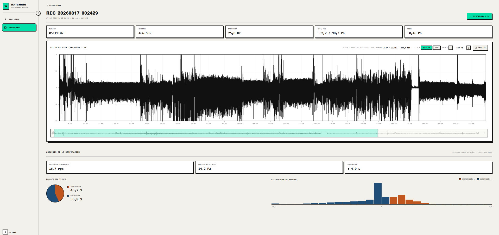
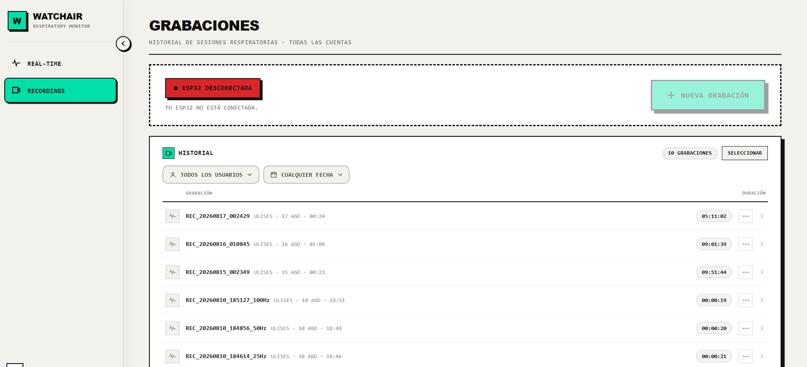
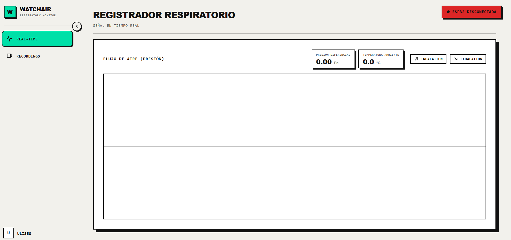

# WatchAir

Sleep breathing monitor built from scratch: an ESP32 with a pressure sensor records your breathing
through the night, and a web app shows it live and stores every recording.



## How it works

A nasal cannula connects to a Sensirion SDP3x differential-pressure sensor on an ESP32.

- **Firmware (C++, FreeRTOS):** samples at a steady 25 Hz and writes to a microSD card. If the
  power cuts out, it resumes the same file when it reboots. Recordings upload when there is Wi-Fi
  and are only deleted from the card once the server confirms them.
- **Backend (Python, FastAPI on AWS EC2):** WebSocket hub that relays the live signal to the
  browser and receives the uploaded recordings.
- **Frontend (Next.js, TypeScript):** live chart, recording history and a detail view per night
  with breathing rate and pressure stats. Google login.
- **Storage:** Supabase (Postgres + Storage).

Recordings use a small binary format (6 bytes per sample) instead of JSON, so a 12-hour night is
about 6.5 MB. The format is described in [ONE-BREATH.md](ONE-BREATH.md).

## Screenshots

Recording history:



Live view (device offline):



## Running it

You need PlatformIO, uv (Python 3.11+), Node 20+ and a Supabase project.

```bash
# database: run server/migrations/*.sql in Supabase and create a private bucket "watchair"

# backend
cd server && cp .env.example .env && uv sync
uv run uvicorn app.main:app --host 0.0.0.0 --port 8000

# frontend
cd frontend && cp .env.example .env.local && npm install && npm run dev

# firmware
cd esp32 && cp include/secrets.h.example include/secrets.h
platformio run -t upload
```

Not a medical device. MIT licensed.
