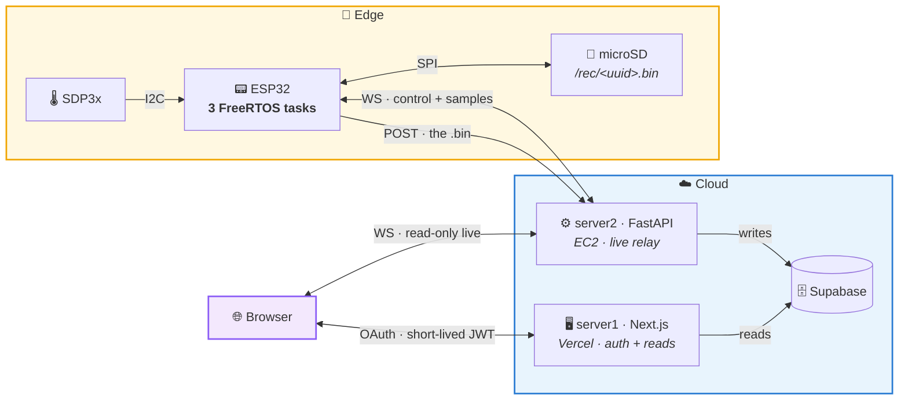

<div align="center">

# 🌬️ WatchAir

### Real-time respiratory monitoring — from the sensor die to the browser canvas

*An ESP32 samples a differential-pressure sensor at a rock-steady 25 Hz, writes every breath to an
SD card, survives power cuts, and streams the waveform live to the web.*

<br/>

[](https://www.espressif.com/)
[](https://isocpp.org/)
[](https://fastapi.tiangolo.com/)
[](https://nextjs.org/)
[](https://www.typescriptlang.org/)
[](https://supabase.com/)

[](LICENSE)
[](#-roadmap)

</div>

---

## 🎯 What it does

A nasal cannula feeds a [Sensirion SDP3x](https://sensirion.com/products/catalog/SDP31)
differential-pressure sensor wired to an ESP32. The board samples breathing at 25 Hz, records it to
microSD, uploads finished recordings to the cloud, and mirrors the live waveform to a browser when
someone is actually watching.

The interesting part isn't the graph — it's what has to be true for the graph to be trustworthy:

> The device keeps recording when the Wi-Fi drops. It resumes mid-file after a power cut with the
> timeline intact. It never deletes a recording until the server confirms it in writing. And the UI
> never *guesses* what the device is doing — it can only show what the device actually said.

---

## 🧩 How it fits together



**Why two servers?** They fail differently, so they're separated on purpose. server1 owns identity
and history pages; server2 owns live sockets, device control and ingestion, and is the only writer
to Supabase. If server1 dies you can't log in, but the device keeps recording. The only bridge
between them is a 15-minute JWT that the browser carries from one to the other.

---

## 🧠 Engineering choices worth defending

| Decision | Why |
|:--|:--|
| **Three FreeRTOS tasks**, one job each — sampler (prio 5, core 1), SD, network (core 0) | a 100 ms SD flush can't eat a sample; the radio can't stall the sensor |
| **`vTaskDelayUntil` + a fixed time anchor** | no cumulative drift, and hourly SNTP *jumps* can't warp a recording's timeline |
| **SD-first, cloud-second**; delete only after HTTP `200` | Wi-Fi is an optional luxury, retries are idempotent, data loss is not a failure mode |
| **Crash-resume from the file's own header** | a reboot mid-recording reopens the same file — the outage shows as a gap in the line, not as a lie |
| **Broadcasting is derived state, not a stored flag** | `desired = any browser watching`, reconciled once a second, so a dropped command self-heals |
| **One `status` message, no ACKs** | the device *proves* its state every 2 s; the server keeps no books and rebuilds itself from the next status |
| **6-byte binary records instead of JSON** | 12 h at 25 Hz is 6.5 MB instead of ~40 MB, and a `memcpy` instead of a serializer in the hot path |

---

## 🛠️ Stack

<table>
<tr>
<td width="33%" valign="top">

### 📟 Firmware
`C++` · `Arduino-ESP32`<br/>
`FreeRTOS` · `PlatformIO`

3 pinned tasks · 2 queues · SPI microSD ·
I2C SDP3x · SNTP · WebSocket client

</td>
<td width="33%" valign="top">

### ⚙️ Backend
`Python 3.11+` · `FastAPI`<br/>
`uvicorn` · `uv` · `PyJWT`

Async WS hub · zero persistence ·
streaming uploads · Supabase · EC2

</td>
<td width="33%" valign="top">

### 🌐 Frontend
`Next.js 16` · `React 19`<br/>
`TypeScript 5` · `Tailwind 4`

ECharts @ 25 Hz · Auth.js v5 ·
auto-reconnecting WS · Vercel

</td>
</tr>
</table>

---

## 📐 The file format

One `.bin` per recording. Identical bytes on the SD card, in the HTTP body and in Supabase Storage —
nothing re-encodes it along the way. See [ONE-BREATH.md](ONE-BREATH.md) for a byte-by-byte tour.

```
header (30 B)   WAIR │ v3 │ uuid(16) │ hz │ started_epoch_ms(u64 LE)
record  (6 B)   t_ms(u32 LE) │ p_centiPa(i16 LE)      ← repeated, forever
```

`started_epoch_ms` is the t=0 for the whole timeline and the value that fills `started_at` in
Postgres. The server never substitutes a `datetime.now()` — **the file is the authority**.

Three implementations must agree on these bytes:
[`recorder.h`](esp32/include/recorder.h) ·
[`recordings.py`](server/app/recordings.py) ·
[`binaryFormat.ts`](frontend/app/lib/binaryFormat.ts)

---

## 🚀 Getting started

You'll need [PlatformIO](https://platformio.org/), [uv](https://docs.astral.sh/uv/) (Python 3.11+),
Node 20+, and a Supabase project.

```bash
# 1 · database — run both migrations in the Supabase SQL editor,
#     then create a private Storage bucket named "watchair"
server/migrations/001_init.sql  →  002_uploaded_at.sql

# 2 · backend (server2)
cd server && cp .env.example .env && uv sync
uv run uvicorn app.main:app --host 0.0.0.0 --port 8000

# 3 · frontend (server1)
cd frontend && cp .env.example .env.local && npm install && npm run dev

# 4 · firmware
cd esp32 && cp include/secrets.h.example include/secrets.h
platformio run -t upload -t monitor
```

<details>
<summary><b>Gotchas worth knowing before you debug them</b></summary>

<br/>

- **Device secrets** are `uuid:secret,uuid:secret`. Use **base64url** (no `+` or `/`) — they travel
  in the ESP32's WebSocket query string and the board has no decent URL-encoder on hand.
- **Missing env vars are a startup crash, not a runtime surprise** — see [`config.py`](server/app/config.py).
- **Mixed content:** an `https://` page can't open a `ws://` connection. Put server2 behind TLS (a
  Cloudflare Tunnel is quickest) and point `NEXT_PUBLIC_SERVER2_URL` at it, scheme included.
- **Wiring:** SDP3x on I2C `SDA=4 · SCL=21` (addr `0x25`), microSD on VSPI `CS=5 · SCK=18 · MISO=19
  · MOSI=23`. If `SD.begin()` fails, drop `SD_SPI_HZ` to 10 MHz — some modules won't hold 20.
- **Google OAuth** callback: `<origin>/api/auth/callback/google`. Sign-in is rejected for any email
  without a `devices` row — there's no self-signup.

</details>

---

## 🧭 Roadmap

- [x] 25 Hz drift-free sampling · binary format with crash-resume · per-device auth
- [x] Live waveform, recording history and playback
- [x] Idempotent delete-on-200 upload pipeline
- [ ] 🔐 Lock CORS down to the deployed origin *(currently `*`, flagged in `main.py`)*
- [ ] 📈 Breath-rate derivation (breaths/min) from the pressure signal
- [ ] 📤 CSV / EDF export · 🔁 CI for firmware build + lint · 🌍 self-service provisioning

---

<div align="center">

Built by **Ulises Pla Rocher** — a hobby project that became an excuse to do embedded systems,
real-time protocols and full-stack web *properly*, end to end.

*Source comments and design notes are in Spanish; the code and this README are in English.*

[](mailto:ulisesplarocher@gmail.com)

📄 [MIT](LICENSE) · <sub>⚠️ Not a medical device. Not for diagnosis, treatment or any clinical decision.</sub>

</div>
